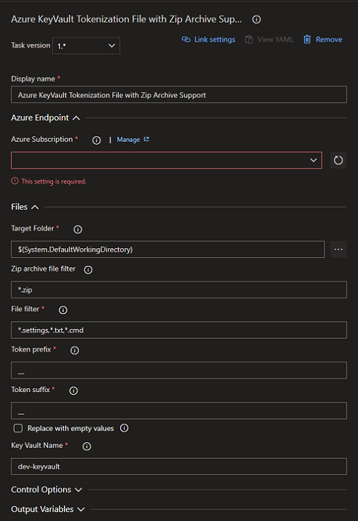

# Azure Key Vault Tokenization File with Zip Archive Support

Tool for tokenize files, inside or not of a zip archive using Azure Key Vault Secrets.

This tool scans directories, subdirectories and zip files recursively, the search can be configured with more than one pattern, after finding a file match, it searches for tokens inside that match secrets in Azure Key Vault to replace their values.

# Develop by

[Alexlofern](https://www.linkedin.com/in/alexlofern/)

If you like, please donate

# Dependencies

You need install:
#### Windows environment
1. Powershell 5.1 (If legate windows systems, download [here](https://www.microsoft.com/en-us/download/details.aspx?id=54616))
2. AZ Module (Instructions [here](https://www.powershellgallery.com/packages/Az))
#### Linux environment
1. I add the shebang to script `#!/usr/bin/env pwsh` according this best practices [here](https://github.com/PoshCode/PowerShellPracticeAndStyle/issues/68)  
2.  Powershell on Linux [here if you need](https://docs.microsoft.com/en-us/powershell/scripting/install/installing-powershell-core-on-linux)
3. AZ Module (Instructions [here](https://www.powershellgallery.com/packages/Az))

# Parameters

# Privacy Police

All data and logs generated in the Azure DevOps agents are thrown away, leaving only the console logs in your pipeline.

# Log output sample

'##[section]Starting: Azure Key Vault Tokenization File with Zip Archive Support
'==============================================================================
 Task         : Azure Key Vault Tokenization File with Zip Archive Support
 Description  : Tool for tokenize files, inside or not of a zip archive using Azure KeyVault Secrets.
 Version      : 1.0.56
 Author       : Alexlofern
 Help         : 
'==============================================================================
 
 Login at Azure DevOps endpoint...
'==============================================================================
 
 
 
 Name               : Contoso - DEV (xxxxxxxx-xxxx-xxxx-xxxx-xxxxxxxxxxxx) - ***
 Account            : ***
 Environment        : AzureCloud
 Subscription       : xxxxxxxx-xxxx-xxxx-xxxx-xxxxxxxxxxxx
 Tenant             : ***
 TokenCache         : Microsoft.Azure.Commands.Common.Authentication.Core.ProtectedFileTokenCache
 VersionProfile     : 
 ExtendedProperties : {}
 
 
 
 
'==============================================================================
 
 Key Vault
'==============================================================================
 
 Verifying KeyVault:  dev-keyvault-contoso
 Verifying access policy permission to get secrets...
      Key Vault dev-keyvault-contoso have 360 secrets
 
'==============================================================================
 
 Files
'==============================================================================
 
 
       Filter:  *.settings Total files found: 4
 
             Tokening file:  E:\Default-Pool\02\_work\716\s\app.Release.settings Total tokens found: 4
                    __ambiente__ replaced!
                    __ADContosoDomain__ replaced!
                    __ADContosoDomainV2__ not found!
                    __ADContosoInstance__ replaced!
 
             Tokening file:  E:\Default-Pool\02\_work\716\s\app.settings Total tokens found: 3
                    __ambiente__ replaced!
                    __ADContosoDomain__ replaced!
                    __ADContosoInstance__ replaced!
 
             Tokening file:  E:\Default-Pool\02\_work\716\s\Subfolder\app.Release.settings Total tokens found: 4
                    __ambiente__ replaced!
                    __ADContosoDomain__ replaced!
                    __ADContosoDomainV2__ not found!
                    __ADContosoInstance__ replaced!
 
             Tokening file:  E:\Default-Pool\02\_work\716\s\Subfolder\app.settings Total tokens found: 3
                    __ambiente__ replaced!
                    __ADContosoDomain__ replaced!
                    __ADContosoInstance__ replaced!
 
       Filter:  *.txt Total files found: 1
 
             Tokening file:  E:\Default-Pool\02\_work\716\s\Text.txt Total tokens found: 3
                    __ambiente__ replaced!
                    __ADContosoDomain__ replaced!
                    __ADContosoInstance__ replaced!
 
       Filter:  *.cmd Total files found: 0
 
'==============================================================================
 
 Packages
'==============================================================================
 
 
 Package filter:  *.zip Total package files: 3
 
       Tokening package file:  E:\Default-Pool\02\_work\716\s\Package.zip
 
             Filter:  *.settings Total files found in zip: 4
 
                   File:  app.Release.settings Total tokens found: 3
                          __ambiente__ replaced!
                          __ADContosoDomain__ replaced!
                          __ADContosoInstance__ replaced!
 
                   File:  app.settings Total tokens found: 3
                          __ambiente__ replaced!
                          __ADContosoDomain__ replaced!
                          __ADContosoInstance__ replaced!
 
                   File:  Subfolder\app.Release.settings Total tokens found: 4
                          __ambiente__ replaced!
                          __ADContosoDomain__ replaced!
                          __ADContosoDomainV2__ not found in Key Vault!
                          __ADContosoInstance__ replaced!
 
                   File:  Subfolder\app.settings Total tokens found: 3
                          __ambiente__ replaced!
                          __ADContosoDomain__ replaced!
                          __ADContosoInstance__ replaced!
 
             Filter:  *.txt Total files found in zip: 1
 
                   File:  Text.txt Total tokens found: 3
                          __ambiente__ replaced!
                          __ADContosoDomain__ replaced!
                          __ADContosoInstance__ replaced!
 
             Filter:  *.cmd Total files found in zip: 0
 
       Tokening package file:  E:\Default-Pool\02\_work\716\s\PackageV2.zip
 
             Filter:  *.settings Total files found in zip: 4
 
                   File:  app.Release.settings Total tokens found: 3
                          __ambiente__ replaced!
                          __ADContosoDomain__ replaced!
                          __ADContosoInstance__ replaced!
 
                   File:  app.settings Total tokens found: 3
                          __ambiente__ replaced!
                          __ADContosoDomain__ replaced!
                          __ADContosoInstance__ replaced!
 
                   File:  Subfolder\app.Release.settings Total tokens found: 4
                          __ambiente__ replaced!
                          __ADContosoDomain__ replaced!
                          __ADContosoDomainV2__ not found in Key Vault!
                          __ADContosoInstance__ replaced!
 
                   File:  Subfolder\app.settings Total tokens found: 3
                          __ambiente__ replaced!
                          __ADContosoDomain__ replaced!
                          __ADContosoInstance__ replaced!
 
             Filter:  *.txt Total files found in zip: 1
 
                   File:  Text.txt Total tokens found: 3
                          __ambiente__ replaced!
                          __ADContosoDomain__ replaced!
                          __ADContosoInstance__ replaced!
 
             Filter:  *.cmd Total files found in zip: 0
 
       Tokening package file:  E:\Default-Pool\02\_work\716\s\Subfolder\PackageV2.zip
 
             Filter:  *.settings Total files found in zip: 4
 
                   File:  app.Release.settings Total tokens found: 3
                          __ambiente__ replaced!
                          __ADContosoDomain__ replaced!
                          __ADContosoInstance__ replaced!
 
                   File:  app.settings Total tokens found: 3
                          __ambiente__ replaced!
                          __ADContosoDomain__ replaced!
                          __ADContosoInstance__ replaced!
 
                   File:  Subfolder\app.Release.settings Total tokens found: 4
                          __ambiente__ replaced!
                          __ADContosoDomain__ replaced!
                          __ADContosoDomainV2__ not found in Key Vault!
                          __ADContosoInstance__ replaced!
 
                   File:  Subfolder\app.settings Total tokens found: 3
                          __ambiente__ replaced!
                          __ADContosoDomain__ replaced!
                          __ADContosoInstance__ replaced!
 
             Filter:  *.txt Total files found in zip: 1
 
                   File:  Text.txt Total tokens found: 3
                          __ambiente__ replaced!
                          __ADContosoDomain__ replaced!
                          __ADContosoInstance__ replaced!
 
             Filter:  *.cmd Total files found in zip: 0
 
'==============================================================================
 
'##[section]Finishing: Azure Key Vault Tokenization File with Zip Archive Support

